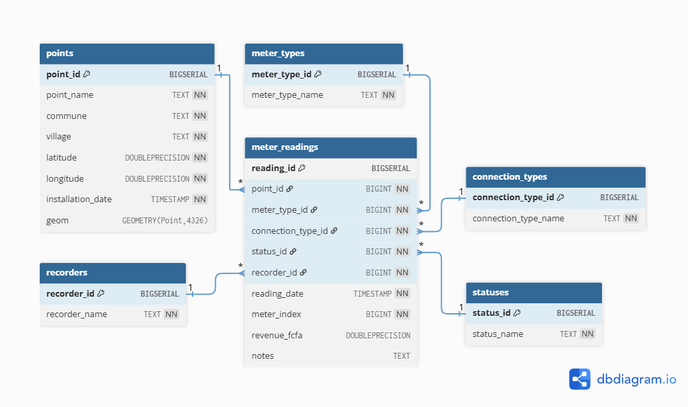
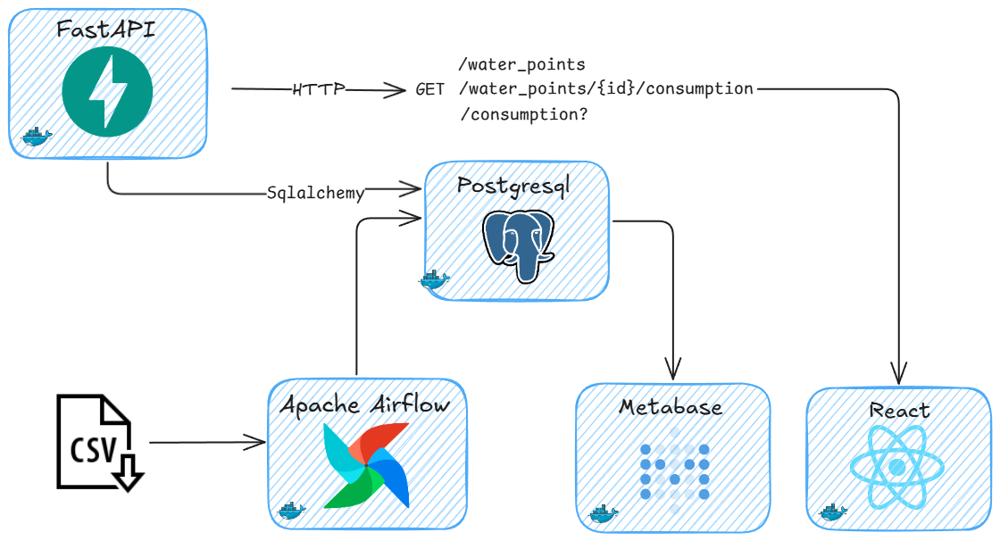
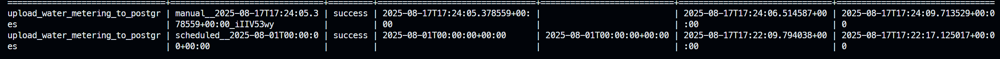
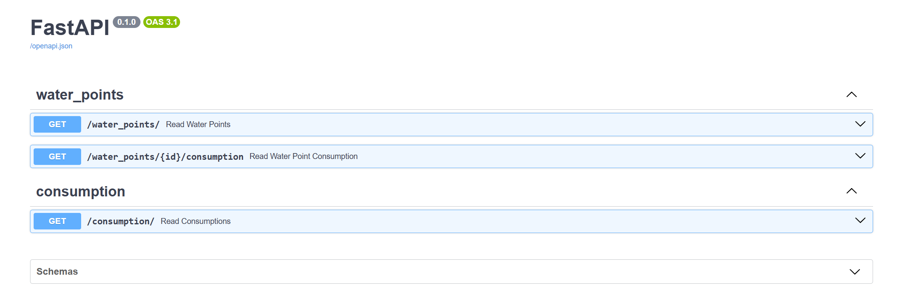

# Documentation de la solution au Technical Assessment

---

Cette documentation a pour but de vous guider à travers le processus de mise en place et de test de l'application.

## Prérequis

Pour lancer le projet, vous devez avoir installé:

* [Docker](https://www.docker.com/)
* [Docker Compose](https://docs.docker.com/compose/)
* [Makefile](https://www.gnu.org/software/make/)
* [uv](https://docs.astral.sh/uv/)

## Cloner le projet en local

```bash
git clone https://github.com/IbrahimOued/water-data-assessment.git
cd water-data-assessment
```
## Architecture de la base de données



## Architecture du système

* Serveur backend: **FastAPI**
* Base de données: **PostgreSQL**
* Orchestrateur de workflows: **Apache Airflow**
* Frontend: **React**
* Business Intelligence: **Metabase**



## Lancement du projet

### Avec Makefile Linux si installé (Recommandé car plus simple)

#### Pour lancer les différentes applications de la stack

```bash
make start
```

Cela lancera tous les conteneurs Docker définis dans le fichier `docker-compose.yaml`.

#### Pour générer les credentials de connexion pour Apache Airflow

```bash
make credentials
```

> Note: Les informations seront dans le fichier `airflow_credentials.txt` à la racine.

### Avec Docker compose

#### Pour lancer les différentes applications de la stack 

```bash
docker-compose up
```

Cela lancera tous les conteneurs Docker définis dans le fichier `docker-compose.yaml`.

#### Trigger le DAG

```bash
docker exec airflow airflow dags trigger upload_water_metering_to_postgres
```

#### Vérification de l'état du DAG

```bash
docker exec airflow airflow dags list-runs upload_water_metering_to_postgres
```
L'état du DAG sera affiché `success` dans la sortie.



#### Pour générer les credentials de connexion pour Apache Airflow

```bash
docker exec airflow bash -c "cat simple_auth_manager_passwords.json.generated" > airflow_credentials.txt
```

## Test des différents services

### Tester le serveur backend

#### En utilisant swagger

Allez sur [http://localhost:8000/docs](http://localhost:8000/docs) pour accéder à la documentation Swagger.
Vous aurez accès à tous les endpoints de l'API que vous pourrez tester directement.



#### Via CURL

Exemple de requête pour les points d'eau:

```bash
curl -X 'GET' \
  'http://localhost:8000/water_points/' \
  -H 'accept: application/json'
```

### Tester le serveur frontend

Allez sur le [http://localhost:5000](http://localhost:5000) pour accéder à l'application frontend.
Il s'agit d'une single page react qui affiche les différents points d'eau sur la map en utilisant des composants de la bibliothèque React-Leaflet.

### Tester l'outil de Business Intelligence

Allez sur le [http://localhost:3000](http://localhost:3000) pour accéder à Metabase, l'outil de Business Intelligence.

Cet outil vous permettra de créer des tableaux de bord et des rapports à partir des données de votre application. Il inclue une interface utilisateur conviviale pour explorer et visualiser vos données et un mode d'administration qui permet de créer des utilisateurs avec différents niveaux d'accès.

Une démonstration en sera faite.

### Tester Apache Airflow

Allez sur le [http://localhost:8080](http://localhost:8080) pour accéder à l'interface web d'Apache Airflow.
Les informations de connexions sont disponibles dans le fichier `airflow_credentials.txt` à la racine.

> Note: Assurez vous d'avoir exécuter `make credentials` (si vous utilisez Makefile) ou la commande:
> `docker exec airflow bash -c "cat simple_auth_manager_passwords.json.generated" > airflow_credentials.txt`
> afin de pouvoir générer les informations de connexion et vous connecter à l'interface Apache Airflow.

Cet outil vous permettra de créer des workflows et des tâches automatisées pour notre application, d'intégrer une pipeline ETL automatisée. Ici nous l'utilisons
dans un exemple simple afin d'extraire les données via le fichier CSV (dans un cas réel, cela pourrait être une API, une base de données ou des capteurs), de les transformer et de les charger dans la base de données PostgreSQL.

## Conclusion

Pour stopper les différents services, vous pouvez utiliser la commande suivante:

```bash
make stop
```

Ou si vous utilisez Docker Compose, vous pouvez utiliser la commande suivante:

```bash
docker-compose down
```
